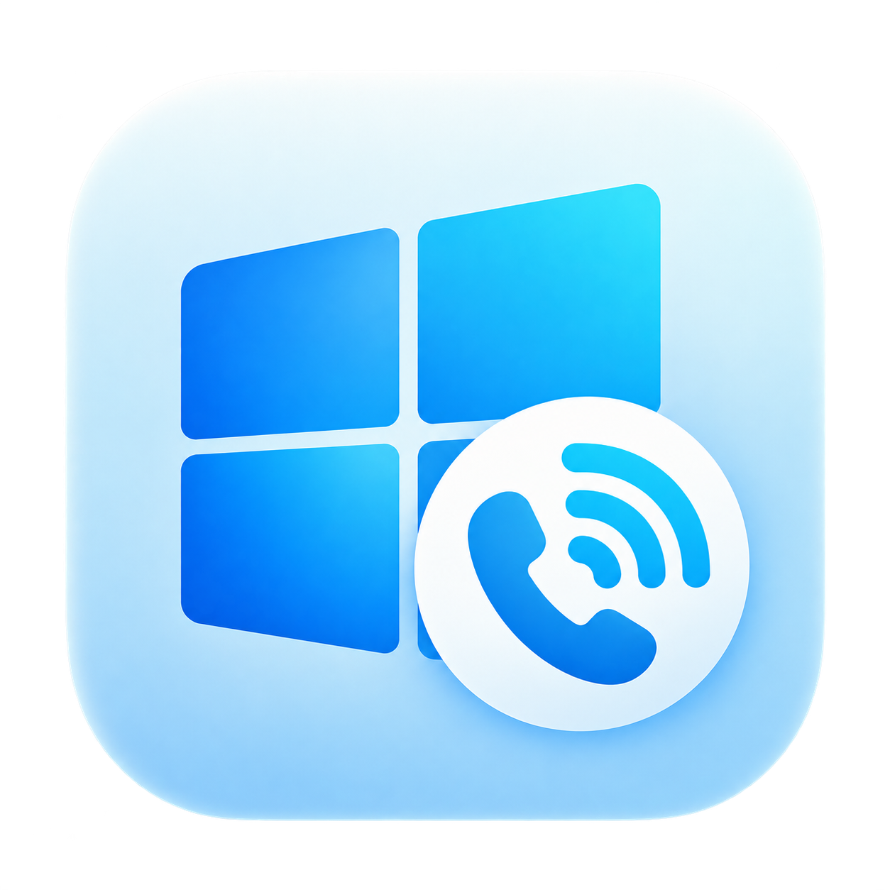
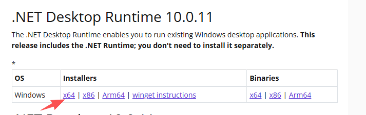

# VoWin

<p align="center">
  
</p>

<p align="center">
  <b>Windows 蜂窝模组、SIM / eSIM、短信与实验性 VoWiFi 管理终端</b><br />
  物理 SIM 与 eSIM 管理 · 多模组卡槽 · 短信 · 通话 · SOCKS5 分流 · 微信 / QQ 远程控制
</p>

<p align="center">
  <a href="https://github.com/unikgyd/VoWin">GitHub</a> ·
  <a href="https://x.com/Unikgyd99">X / Twitter @Unikgyd99</a> ·
  <a href="https://t.me/VoWindows1">Telegram 交流群</a>
</p>

> 本项目用于合法的个人研究、模组调试与已获授权的通信测试。VoWiFi、IMS 通话及 eSIM 下载均取决于模组、SIM、运营商开通状态和网络策略，不能保证对任意设备或运营商可用。

## 安装教程

### 1. 准备运行环境

VoWin 面向 Windows 10 / 11 x64。运行发布版只需要安装 **.NET 10 Desktop Runtime x64**，不必安装完整 SDK。

1. 打开 [.NET 10 下载页面](https://dotnet.microsoft.com/download/dotnet/10.0)。
2. 找到 **.NET Desktop Runtime**，在 Windows 一栏选择 **x64** 安装包。
3. 安装完成后再启动 VoWin；如果此前已经打开程序，请退出后重新运行。



> “.NET Runtime”和“.NET Desktop Runtime”不是同一个下载项。VoWin 是 WPF 桌面程序，应安装 Desktop Runtime。只有准备编译源码时才需要 .NET 10 SDK。

### 2. 安装模组驱动

仓库附带了 [Quectel Windows USB Driver](<Quectel_Windows_USB_Driver(Q)_NDIS_V2.8_EN.zip>)，适用于常见的移远 EC20/EC25 系列及部分兼容模组。

1. 解压驱动包并运行其中的安装程序。
2. 重新插拔模组，打开 Windows **设备管理器**。
3. 展开“端口（COM 和 LPT）”，确认模组已经枚举出多个 COM 端口。
4. 记下 AT 命令端口的 COM 编号；不要选择诊断口、NMEA 口或已被其他软件占用的端口。

DJI 4G 模块在部分硬件版本上需要先修改 USB ID，才能由通用驱动正确识别。修改前请确认具体模块版本并备份原始参数，不要直接套用其他型号的命令。

### 3. 获取和启动 VoWin

- 普通用户：从 [GitHub Releases](https://github.com/unikgyd/VoWin/releases) 下载 Windows x64 发布包，解压后运行 `VoWin.exe`。
- 开发者：克隆仓库后按下方“从源码运行与发布”章节编译。

VoWin 默认按当前 Windows 用户权限运行。若设备驱动或本机串口安全策略阻止访问，再尝试以管理员身份启动。

## 5 分钟上手

### 第一步：添加模组并确认 SIM

1. 打开 **Modem 管理** 页面，点击扫描，选择刚才确认的 AT 串口。
2. 等待卡槽状态变为 `SIM Ready`。
3. 检查 IMEI、ICCID、IMSI、信号强度和网络注册状态；如果读取失败，先排除驱动、供电、SIM PIN 和串口占用问题。
4. 返回 **系统状态**。首页会把卡品牌和网络认证身份分开显示：
   - **ICCID 卡配置归属**：这是一张什么卡，例如 DITO 菲律宾；
   - **IMSI 认证归属（PLMN）**：实际鉴权所用的网络身份，例如荷兰 `204-04`。

ICCID 与 IMSI 的国家不同并不一定是识别错误，旅行卡、多 IMSI 卡或托管核心网可能出现这种情况。

### 第二步：开始使用

| 想做什么 | 去哪里 | 操作 |
| --- | --- | --- |
| 收发短信 | **短信** | 选择会话或输入号码；长短信自动分片/拼接，验证码短信会弹窗 |
| 拨打电话 | **电话** | 选择卡槽、输入号码并拨号；需要时可强制使用蜂窝通话 |
| 查看卡和信号 | **系统状态** | 查看 ICCID/IMSI 归属、信号、注册状态和 VoWiFi 四阶段日志 |
| 管理多卡 | **Modem 管理** | 扫描模组、切换卡槽、设置默认通话/短信卡及刷新 SIM |
| 设置网络出口 | **代理分流** | 按卡槽或 MCC 选择直连/SOCKS5；VoWiFi 不支持 HTTP 代理 |
| 管理 eSIM | **Modem 管理** | 读取 EID/Profile，扫描或粘贴 `LPA:1` 激活码并管理 Profile |
| 手机远程控制 | **远程控制** | 配置微信 iLink 或 QQ 官方 Bot，并授权允许操作的账号 |

### 第三步：连接 VoWiFi

1. 确认 SIM 已由运营商开通 VoWiFi / IMS，且当前网络允许连接其 ePDG。
2. 在首页或 **Modem 管理** 选择卡槽，点击 **连接 VoWiFi**。
3. 依次观察 ePDG 解析、IKEv2/EAP-AKA 鉴权、IPsec 通道和 IMS 注册四个阶段。
4. 如运营商要求特定出口，在 **代理分流** 中为该卡槽配置可用的 SOCKS5 节点后重试。

卡能上网不代表 VoWiFi 一定已开通。若连接失败，请先看失败发生在哪个阶段，再检查 SIM 权限、IMSI/ICCID、DNS、代理和系统日志。

### eSIM 与远程控制

- eSIM 功能要求模组或读卡器能够向 eUICC 发送 APDU。下载前请保存激活码，操作后重新读取 Profile 确认结果。
- 微信：在 **远程控制** 页面点击“微信扫码登录”，扫码账号会加入授权列表。
- QQ：先在 QQ 开放平台创建机器人并启用群消息/C2C 消息事件，再把 AppID 和 AppSecret 填入页面并验证凭据。
- 其他账号需要在页面生成一次性配对码，然后向机器人发送 `绑定 123456`。配对码 10 分钟有效且只能使用一次，未授权用户不能执行设备命令。

常用远程命令：

```text
状态
验证码 [数量]
短信 <号码> <内容>
拨号 <号码>
接听 / 拒接 / 挂断
卡片
切卡 <序号/卡槽ID/ICCID后四位>
VoWiFi 开|关
飞行模式 开|关
刷新
帮助
```

## 能做什么

- 自动发现/管理多个蜂窝模组和卡槽，读取 SIM 身份、网络注册和信号。
- 使用 AT PDU 或 IMS 通道收发短信，持久化会话、解析送达回执并重组长短信。
- 管理支持 GSMA SGP.22 的 eSIM/eUICC Profile。
- 为单卡槽或按 MCC 配置直连与 SOCKS5 出站路径。
- 提供实验性的 VoWiFi、IMS 注册和通话能力，以及蜂窝语音、来电/短信通知和录音。
- 通过官方微信/QQ Bot 在已授权账号中查询状态、收发短信、拨号、切卡和控制 VoWiFi。

## 实现概览

VoWin 是 WPF 桌面界面，`voSharp` 是底层 C# 通信核心：

```text
Windows UI
  └─ VoSharp.Kernel：多卡槽、状态、事件和路由协调
       ├─ Modem / SIM：COM AT、PDU、USIM AKA、PC/SC
       ├─ Telephony：短信、通话、VoWiFi 编排
       ├─ IKE / ESP：IKEv2、EAP-AKA、用户态 ESP 封装
       ├─ SIP：IMS 注册、SIP MESSAGE、通话会话
       └─ Euicc：Profile 生命周期与 SGP.22 流程
```

VoWiFi 数据面在用户态通过标准 Socket 处理 IKE/ESP 与 IMS 流量；当前运行路径**不需要额外网络驱动，也不修改系统路由**。SIM 的 AKA 运算优先由实体 SIM/USIM 完成，不要求导出根密钥。

## 从源码运行与发布

```powershell
# 还原、编译和运行测试
dotnet restore VoWin.slnx
dotnet build VoWin.slnx --no-restore
dotnet test VoWin.slnx --no-restore

# 启动桌面程序
dotnet run --project VoWin/VoWin.csproj

# 生成 framework-dependent 单文件发布包
.\publish-single-file.bat
```

发布结果位于 `publish/win-x64/VoWin.exe`。它是 framework-dependent 发布包，目标电脑仍需安装对应的 .NET 10 Windows Desktop Runtime。

## 项目结构

```text
VoWin/
├── VoWin/                    # WPF 桌面程序：页面、MVVM、设置和本地数据库
├── voSharp/
│   ├── src/                  # Modem、SIM、eUICC、IKE、SIP、短信、通话和内核
│   └── tests/                # 协议与业务自动化测试
└── publish-single-file.bat   # Windows x64 发布脚本
```

## 已知边界

- 各运营商的 ePDG、IMS 安全协商、短信下行和音频策略差异很大；应先在目标 SIM 和网络上验证。
- eSIM 功能需要硬件本身支持 eUICC 及必要的 APDU 通道。
- 不要将 SIM、IMSI、ICCID、激活码、代理凭据或远程控制密钥提交到 Issue、日志或截图中。

## 项目与交流

- GitHub 仓库：[unikgyd/VoWin](https://github.com/unikgyd/VoWin)
- 问题反馈：[GitHub Issues](https://github.com/unikgyd/VoWin/issues)
- X / Twitter：[@Unikgyd99](https://x.com/Unikgyd99)
- Telegram 交流群：[t.me/VoWindows1](https://t.me/VoWindows1)

## 赞助支持

如果你觉得本项目有用，并且你当前手上有闲钱，可以赞助坐着一杯咖啡吗？你的赞助是我最大的动力

| 资产与网络 | 地址 |
| --- | --- |
| USDT · TRON（TRC-20） | `TDecoS5mFozuyfJSR2QhSsWbCkGm8nsvpH` |
| USDT · BNB Smart Chain（BEP-20） | `0x0e5e07b7604d8585fd936527f48874a10ad8b884` |
| USDT · Polygon | `0x0e5e07b7604d8585fd936527f48874a10ad8b884` |

## 免责声明

本项目免费开源，仅用于合法授权的技术研究、通信测试和学习。使用者应自行遵守所在地法律、电信规则、运营商条款及隐私义务；开发者不对不当使用或由此造成的损失承担责任。

## 致以特别敬意

vohive:众所周知的vowifi初代目

vocat:二代目，大部分代码借鉴他的

mdd-sim-gateway:三代目，也是借鉴他的代码


