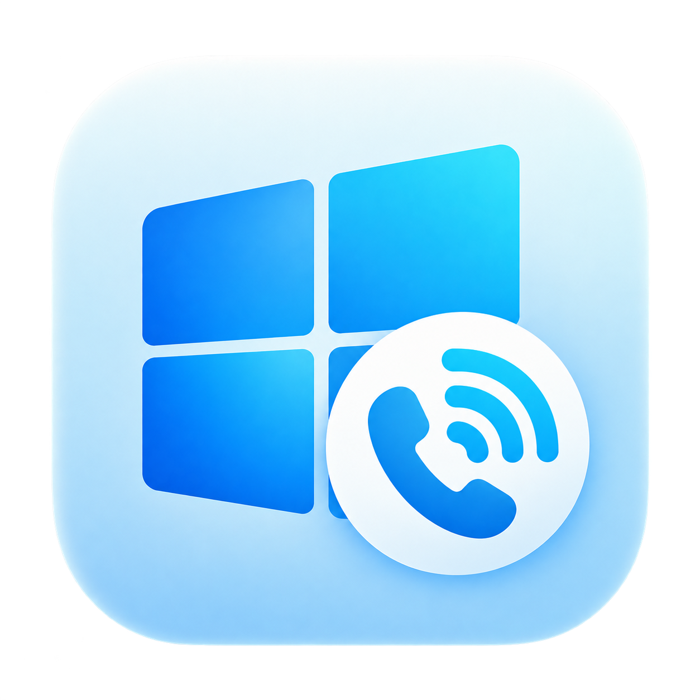
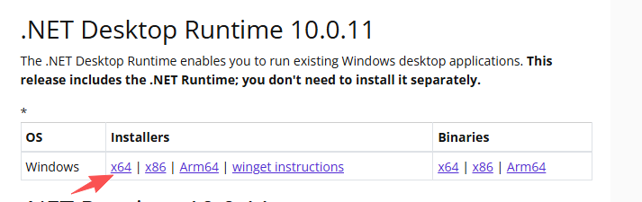
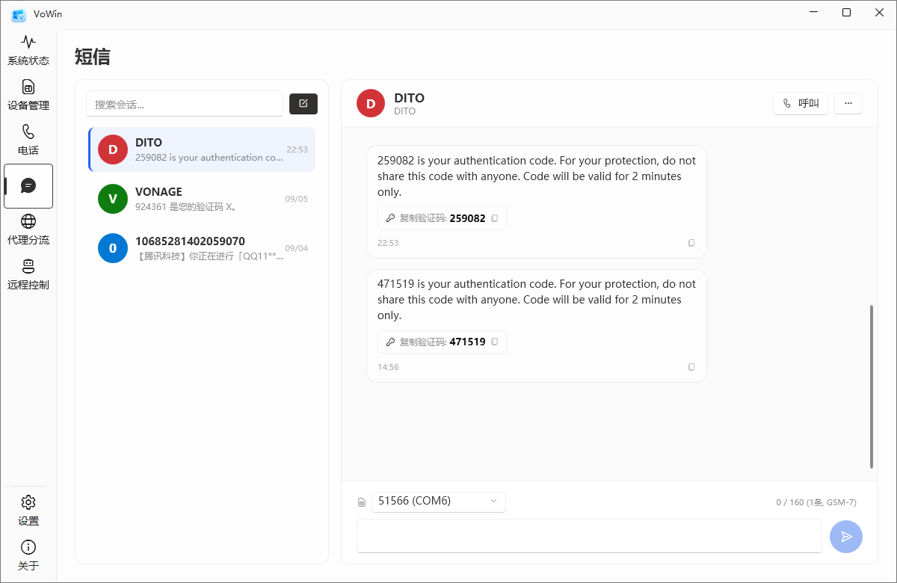
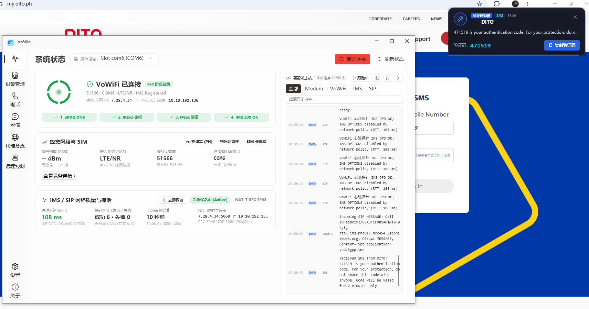

# VoWin：还在为没有Linux或mac而无法用上vowifi而困扰？

[](https://github.com/unikgyd/VoWin/actions/workflows/release.yml)

<p align="center">
  
</p>

<p align="center">
  <b>Windows 蜂窝模组、SIM / eSIM、短信与实验性 VoWiFi 管理终端</b><br />
  物理 SIM 与 eSIM 管理 · 多模组卡槽 · 短信 · 通话 · 私网 SIP 网关 · SOCKS5 分流 · 微信 / QQ 远程控制
</p>

<p align="center">
  <a href="https://github.com/unikgyd/VoWin">GitHub</a> ·
  <a href="https://x.com/Unikgyd99">X / Twitter @Unikgyd99</a> ·
  <a href="https://t.me/VoWindows1">Telegram 交流群</a>
</p>

> 本项目用于合法的个人研究、模组调试与已获授权的通信测试。VoWiFi、IMS 通话及 eSIM 下载均取决于模组、SIM、运营商开通状态和网络策略，不能保证对任意设备或运营商可用。

## 赞助支持

如果你觉得本项目有用，可以赞助作者一杯咖啡吗？你的赞助是我最大的动力！

| 资产与网络                       | 地址                                         |
| -------------------------------- | -------------------------------------------- |
| USDT · TRON（TRC-20）            | `TDecoS5mFozuyfJSR2QhSsWbCkGm8nsvpH`         |
| USDT · BNB Smart Chain（BEP-20） | `0x0e5e07b7604d8585fd936527f48874a10ad8b884` |
| USDT · Polygon                   | `0x0e5e07b7604d8585fd936527f48874a10ad8b884` |

`项目目前处于迭代期，可能会有bug。`

`目前测试通过的有:ec20、dji 模块，英国ctexcel、菲律宾dito(新加坡节点/国内直连)`


## 安装教程

### 1. 准备运行环境

VoWin 面向 Windows 10 / 11 x64。运行发布版只需要安装 **.NET 10 Desktop Runtime x64**，不必安装完整 SDK。

1. 打开 [.NET 10 下载页面](https://dotnet.microsoft.com/download/dotnet/10.0)。
2. 找到 **.NET Desktop Runtime**，在 Windows 一栏选择 **x64** 安装包。
3. 安装完成后再启动 VoWin；如果此前已经打开程序，请退出后重新运行。



> “.NET Runtime”和“.NET Desktop Runtime”不是同一个下载项。VoWin 是 WPF 桌面程序，应安装 Desktop Runtime。只有准备编译源码时才需要 .NET 10 SDK。

### 2. 安装模组驱动

仓库附带了 [Quectel Windows USB Driver](<Quectel_Windows_USB_Driver(Q)_NDIS_V2.8_EN.zip>)，适用于常见的移远 EC20/EC25 系列及部分兼容模组。

1. 解压驱动包并运行其中的安装程序。
2. 重新插拔模组，打开 Windows **设备管理器**。
3. 展开“端口（COM 和 LPT）”，确认模组已经枚举出多个 COM 端口。
4. 记下 AT 命令端口的 COM 编号；不要选择诊断口、NMEA 口或已被其他软件占用的端口。

DJI 4G 模块在部分硬件版本上需要先修改 USB ID，才能由通用驱动正确识别。修改前请确认具体模块版本并备份原始参数，不要直接套用其他型号的命令。

### 3. 获取和启动 VoWin

- 普通用户：从 [GitHub Releases](https://github.com/unikgyd/VoWin/releases) 下载 Windows x64 发布包，解压后运行 `VoWin.exe`。
- 开发者：克隆仓库后按下方“从源码运行与发布”章节编译。

VoWin 默认按当前 Windows 用户权限运行。若设备驱动或本机串口安全策略阻止访问，再尝试以管理员身份启动。

## 5 分钟上手

### 第一步：添加模组并确认 SIM

1. 打开 **Modem 管理** 页面，点击扫描，选择刚才确认的 AT 串口。
2. 等待卡槽状态变为 `SIM Ready`。
3. 检查 IMEI、ICCID、IMSI、信号强度和网络注册状态；如果读取失败，先排除驱动、供电、SIM PIN 和串口占用问题。
4. 返回 **系统状态**。首页会把卡品牌和网络认证身份分开显示：
   - **ICCID 卡配置归属**：这是一张什么卡，例如 DITO 菲律宾；
   - **IMSI 认证归属（PLMN）**：实际鉴权所用的网络身份，例如荷兰 `204-04`。

ICCID 与 IMSI 的国家不同并不一定是识别错误，旅行卡、多 IMSI 卡或托管核心网可能出现这种情况。

### 第二步：开始使用

| 想做什么 | 去哪里 | 操作 |
| --- | --- | --- |
| 收发短信 | **短信** | 选择会话或输入号码；长短信自动分片/拼接，验证码短信会弹窗 |
| 拨打电话 | **电话** | 选择卡槽、输入号码并拨号；需要时可强制使用蜂窝通话 |
| 查看卡、信号与 IMS 数据面 | **系统状态** | 查看 ICCID/IMSI 归属、信号、VoWiFi 四阶段日志，并只读探测蜂窝 Host IMS |
| 管理多卡 | **Modem 管理** | 扫描模组、切换卡槽、设置默认通话/短信卡及刷新 SIM |
| 设置网络出口 | **代理分流** | 按卡槽或 MCC 选择直连/SOCKS5；VoWiFi 不支持 HTTP 代理 |
| 管理 eSIM | **Modem 管理** | 读取 EID/Profile，扫描或粘贴 `LPA:1` 激活码并管理 Profile |
| 把电话接到手机软电话 | **设置 → WireGuard SIP 网关** | 填写 WireGuard 本机地址、分机与密码；使用 Linphone/Zoiper 注册 |
| 手机远程控制 | **远程控制** | 配置微信 iLink 或 QQ 官方 Bot，并授权允许操作的账号 |

### 第三步：连接 VoWiFi

1. 确认 SIM 已由运营商开通 VoWiFi / IMS，且当前网络允许连接其 ePDG。
2. 在首页或 **Modem 管理** 选择卡槽，点击 **连接 VoWiFi**。
3. 依次观察 ePDG 解析、IKEv2/EAP-AKA 鉴权、IPsec 通道和 IMS 注册四个阶段。
4. 如运营商要求特定出口，在 **代理分流** 中为该卡槽配置可用的 SOCKS5 节点后重试。

卡能上网不代表 VoWiFi 一定已开通。若连接失败，请先看失败发生在哪个阶段，再检查 SIM 权限、IMSI/ICCID、DNS、代理和系统日志。

### eSIM 与远程控制

- eSIM 功能要求模组或读卡器能够向 eUICC 发送 APDU。下载前请保存激活码，操作后重新读取 Profile 确认结果。
- 微信：在 **远程控制** 页面点击“微信扫码登录”，扫码账号会加入授权列表。
- QQ：先在 QQ 开放平台创建机器人并启用群消息/C2C 消息事件，再把 AppID 和 AppSecret 填入页面并验证凭据。
- 其他账号需要在页面生成一次性配对码，然后向机器人发送 `绑定 123456`。配对码 10 分钟有效且只能使用一次，未授权用户不能执行设备命令。

常用远程命令：

```text
状态
验证码 [数量]
短信 <号码> <内容>
拨号 <号码>
接听 / 拒接 / 挂断
卡片
切卡 <序号/卡槽ID/ICCID后四位>
VoWiFi 开|关
飞行模式 开|关
刷新
帮助
```

## 能做什么

- 自动发现/管理多个蜂窝模组和卡槽，读取 SIM 身份、网络注册和信号。
- 使用 AT PDU 或 IMS 通道收发短信，持久化会话、解析送达回执并重组长短信。
- 管理支持 GSMA SGP.22 的 eSIM/eUICC Profile。
- 为单卡槽或按 MCC 配置直连与 SOCKS5 出站路径。
- 提供实验性的 VoWiFi、IMS 注册和通话能力，以及蜂窝语音、来电/短信通知和录音。
- 提供只监听私网地址的 SIP registrar/B2BUA，将 Windows 侧 VoWiFi IMS 或基带 USB Audio 通话接入 Linphone、Zoiper 等标准 SIP 客户端。
- 通过官方微信/QQ Bot 在已授权账号中查询状态、收发短信、拨号、切卡和控制 VoWiFi。

## 实现概览

VoWin 是 WPF 桌面界面，`voSharp` 是底层 C# 通信核心：

```text
Windows UI
  └─ VoSharp.Kernel：多卡槽、状态、事件和路由协调
       ├─ Modem / SIM：COM AT、PDU、USIM AKA、PC/SC
       ├─ Telephony：短信、通话、VoWiFi 编排
       ├─ IKE / ESP：IKEv2、EAP-AKA、用户态 ESP 封装
       ├─ SIP：IMS 注册、SIP MESSAGE、通话会话
       └─ Euicc：Profile 生命周期与 SGP.22 流程
```

VoWiFi 数据面在用户态通过标准 Socket 处理 IKE/ESP 与 IMS 流量；当前运行路径**不需要额外网络驱动，也不修改系统路由**。SIM 的 AKA 运算优先由实体 SIM/USIM 完成，不要求导出根密钥。

### IMS、VoLTE 与 SIP 桥接

```text
运营商 IMS ← ePDG/IPsec → Windows VoSharp IMS UA ─┐
                                                   ├→ VoWin SIP B2BUA → WireGuard → SIP 软电话
运营商 VoLTE/GSM ← 模组基带 ← USB Audio PCM ─────┘
```

- **优先走 Windows 侧 IMS**：VoWiFi 注册成功时，IKE、ESP、IMS SIP 和 RTP 都由 VoSharp 在 Windows 用户态终止，不需要基带语音音频桥接。
- **基带自动回退**：没有可用 VoWiFi IMS 时，网关用 `ATD`/`ATA` 控制呼叫，并将 Quectel USB Audio Class 的 8 kHz PCM 通过独立 helper 和命名管道直接连接到 SIP RTP，不占用电脑麦克风或扬声器。
- **ADB 仅是 QDC507 兼容层**：普通 UAC 固件完全不探测或调用 ADB。QDC507 固件拒绝 `AT+QPCMV` 且缺少可用的 D4 音频路由，因此只有检测到该固件并实际进入基带通话时，才通过 ADB 在模组内部启动兼容路由；音频数据本身仍走 Windows USB Audio，不经过 ADB。
- **只允许私网监听**：默认拒绝通配地址和公网地址，SIP/RTP 应通过 WireGuard 使用；支持 Digest 登录、多终端注册、来电分叉抢接、外拨、挂断及 DTMF。详见 [SIP Gateway 使用说明](voSharp/docs/SIP_GATEWAY.md)。

### 蜂窝 Host IMS（开发中，不是 VoWiFi）

目标是让 Windows 直接持有模组蜂窝侧 `ims` PDN 的地址和 P-CSCF，再由 VoSharp 完成 AKA、IMS SIP、`ipsec-3gpp` 和 RTP。当前已加入只读的 `host-ims probe`，并在 **系统状态 → 蜂窝 Host IMS 数据面** 提供同一探针的可视化结果：检查 `CGDCONT`、`CGACT`、`CGCONTRDP`、Quectel IMS/USB 网络模式，判断 IMS 地址是否映射到已连接的 Windows 蜂窝/模组网卡，并核对 Windows 到 P-CSCF 的最佳路由是否使用该网卡和 IMS 源地址（不会把 Wi-Fi/VPN 的地址误算成 Host IMS）。它不会改 APN、切 USB 模式或重启模组。

模组已插入但尚无 SIM 时，探针可通过 QMI UIM 确认无卡，并优先只读枚举 QMI WDS 中已配置的 `ims` Profile；QMI 查询不可用时再使用 AT。AT 口已打开时还会检查 AT 响应和 USB 网络模式，未打开则明确标为“未检测”，不冒称可用。它会跳过无意义的动态 PDP 查询；`SimUnavailable` 并非宣称硬件不支持 IMS。插入实体 SIM 或启用 eSIM Profile 后再探测，才能验证运营商实际分配的 IMS PDN、P-CSCF 与 Windows 网卡映射。

模组控制路径现接入同仓库的 `qmi/qmiSharp`：为 AT 口显式配置 `VOWIN_QMI_ENDPOINT_COM6`（`device:` Win32 raw-QMI 路径，或 `tcp://127.0.0.1:<port>` 本机 QMI 代理）时，附着握手会先核对 QMI 与 AT 的 IMEI 确属同一模组；不匹配或 QMI 不可用则该卡槽回退 AT。验证后，SIM 在位、IMEI/IMSI/ICCID、信号和驻网状态优先走 QMI，失败再回退 AT；未配置端点则直接使用 AT。QMI UIM 卡状态会按选中的 GW 主卡及应用解析多卡/eSIM，无法确认选中应用时回退 AT。Host IMS 探针还会优先读取 QMI WDS 已连接 context 的 APN、地址和 P-CSCF；只有 APN 确认为 `ims` 且 Windows 网卡/路由核验通过，才视为可选端点，QMI 不完整则退回只读 AT 探针。底层已有显式持有的独立 QMI IMS bearer 租约，可在启动后核对运行时 IMS APN、地址、P-CSCF，验证失败执行 Stop 回滚；它尚未接入自动注册，也不代表 Windows 已取得对应数据流。普通 COM AT 口不能当作 raw-QMI 口。当前仍没有 raw-QMI 自动发现、可用的 Windows 多 PDN 数据面或真实 WFP IMS IPsec。详见 [qmiSharp](qmi/qmiSharp/README.md)。

界面的“刷新状态”只更新信号与网络注册信息，不会为读取 SIM 而重载基带。插卡或切卡后需要重新识别身份时，在“模组管理”使用带确认提示的“重载 SIM”；该操作会重置基带，并在重置前本地结束旧 Host IMS 通话和会话。开启飞行模式、关闭蜂窝数据或重启模组也会先清理旧 Host IMS 数据面。
当模组明确报告已拔卡时，周期性状态刷新会清除该卡槽显示的旧 SIM 身份和 Host IMS 会话；若读卡失败但插卡状态不明，则不会把未知状态误判成拔卡。

只有探针发现 `HostRoutable` 候选且 Windows 路由核验通过，才能继续建立 Windows Host IMS；若返回 `ModemInternalOnly`，说明 IMS 仍被封在模组内部，需要 MBIM/WWAN IMS context、QMI WDS 多 PDN 或独立 PPP 数据口。**系统状态**页和 CLI 的 `host-ims register|status|stop` 可实验性尝试 SIP 注册：重新确认 IMS 地址和 P-CSCF 路由归 Windows 蜂窝接口所有，并将该 SIP socket 的出站接口固定为核验过的网卡；固定失败不会退回默认网络。注册优先读取 ISIM 配置身份并执行 ISIM AKA：单卡且 QMI UIM 物理槽映射明确时优先经 QMI 逻辑通道完成，QMI 读卡不可用则在 AKA 前回退 AT。仅当 UICC 应用目录可读且确认没有 ISIM、归属 PLMN/MNC 长度可靠时，才按 3GPP 规则从 IMSI 派生临时身份并使用 USIM AKA；此时先预检 QMI USIM 通道，失败才选 AT。QMI AKA 已开始后不会用 AT 重放同一挑战。无论读卡路径如何，首次发包和每次 AKA 前都从当前卡读取 EF.ICCID 核对身份；读卡失败不会触发不安全的身份回退。注册成功后普通拨号、来电接听和私网 SIP 网关可复用该 Host SIP 会话，RTP/RTCP 会绑定 IMS 地址与核验过的 Windows 网卡。主动停止先结束 Host 通话再尝试运营商注销，只有收到 200 OK 才报告远端已注销；换卡、拔模组则只做本地清理。当前不负责激活 bearer，不支持蜂窝侧 `ipsec-3gpp` 数据面；本地模拟 SIP/RTP 测试通过不等于真实 Host VoLTE 已验收。RNDIS/ECM NAT 本身不能把内部 IMS 搬到 Windows。完整设计见 [Windows Host IMS](voSharp/docs/HOST_IMS.md)。

SIP `REGISTER` 的 `200 OK` 仅在响应确认了本机 Contact 且给出正的有效期时才视为注册成功；收到 `423 Min-Expires` 时会保持注册身份和递增的 CSeq，按运营商要求的有效期最多重试一次。注销时也会核对返回的绑定列表确实不再包含本机 Contact。如果 P-CSCF 要求当前尚未实现的 IMS IPsec 数据面，会在调用卡上 AKA 前明确失败；本机已发送 `Security-Client` 而对端省略安全协商时也会拒绝降级。现已按 3GPP 的入站 SPI/端口规则建模两组 Host IMS SA，并覆盖密钥清零测试；模拟后端测试验证了“初始 REGISTER 前绑定并保留双端口、预留 SPI → AKA 后激活 SA → 切换双受保护端口”的编排。默认产品路径没有真实 Windows WFP 后端，不能据此宣称可用蜂窝 IMS IPsec。

### 飞行模式、蜂窝供网与切卡

- VoWiFi 和 SIP 网关启停不会写入 `CFUN` 或 `CGATT`。飞行模式关闭、蜂窝数据开启时，Windows 的 4G/5G 数据接口可以继续供网。
- 飞行模式、蜂窝数据、数据漫游和 VoWiFi 分别保存；快速反复切换采用意图版本控制，较早的异步任务不能覆盖最后一次操作。
- eSIM Profile 切换由卡槽级单一任务持有，切换期间暂停遥测和自动 VoWiFi，避免 AT/APDU 交错。切卡必须让基带重新加载 SIM，因此数据会短暂中断；只有新 ICCID 验证成功后才恢复该卡的设置。

### 当前验证状态

- `dotnet build VoWin/VoWin.csproj --no-restore`：通过，0 错误；离线环境下 NuGet 漏洞数据源不可达，出现 `NU1900` 警告。
- `dotnet test VoWin.slnx --no-restore`：`VoSharp.Tests` 368 项、`VoSharp.Ike.Tests` 54 项、`qmiSharp.Tests` 39 项，共 461 项通过。
- 自动化测试覆盖 SIP Digest 注册、安全绑定、SDP/RTP/DTMF、SIP 事务重传、VoWiFi/IKE 流程等。USB 音频重枚举、运营商 IMS 互操作、来电抢接及真实双向语音仍必须在目标模组、SIM 和运营商网络上验收。

## 从源码运行与发布

```powershell
# 还原、编译和运行测试
dotnet restore VoWin.slnx
dotnet build VoWin.slnx --no-restore
dotnet test VoWin.slnx --no-restore

# 启动桌面程序
dotnet run --project VoWin/VoWin.csproj

# 生成 framework-dependent 单文件发布包
.\publish-single-file.bat 1.2.3
```

发布结果位于 `publish/win-x64/VoWin.exe`。它是 framework-dependent 发布包，目标电脑仍需安装对应的 .NET 10 Windows Desktop Runtime。

### 自动构建与 GitHub Release

推送到 `main` 后，GitHub Actions 会自动编译并上传 Windows x64 的 ZIP 包和 SHA-256 校验文件，可在对应工作流运行的 **Artifacts** 中下载。

发布正式版本时，创建并推送一个符合 `v1.2.3` 格式的标签；工作流会自动打包并创建 GitHub Release：

```powershell
git tag v1.2.3
git push origin v1.2.3
```

也可以在仓库的 **Actions → Build and release VoWin → Run workflow** 中输入版本号来发布。发布包内含 `VoWin.exe`，目标电脑需要 .NET 10 Windows Desktop Runtime x64。

## 项目结构

```text
VoWin/
├── VoWin/                    # WPF 桌面程序：页面、MVVM、设置和本地数据库
├── voSharp/
│   ├── src/                  # Modem、SIM、eUICC、IKE、SIP、短信、通话和内核
│   └── tests/                # 协议与业务自动化测试
└── publish-single-file.bat   # Windows x64 发布脚本
```

## 已知边界

- 各运营商的 ePDG、IMS 安全协商、短信下行和音频策略差异很大；应先在目标 SIM 和网络上验证。
- 蜂窝 Host IMS 仍处于 bearer 探测和接入层开发阶段；当前不会把“探针看到模组内部 IMS”冒充为 Windows 已经取得 IMS 数据面。无 Host IMS 时仍可使用 AT 呼叫控制加 USB Audio PCM 回退。
- SIP Gateway 当前提供 UDP SIP 和普通 RTP，不包含 TLS、SRTP、WebRTC、APNs/CallKit 后台唤醒、会议或呼叫转移；不要把 SIP/RTP 端口直接暴露到公网。
- QDC507 的 ADB 路径是特定固件兼容方案，需要已授权的 root ADB；其他标准 UAC 模组不会使用该路径。
- eSIM 功能需要硬件本身支持 eUICC 及必要的 APDU 通道。
- 不要将 SIM、IMSI、ICCID、激活码、代理凭据或远程控制密钥提交到 Issue、日志或截图中。

## 项目与交流

- GitHub 仓库：[unikgyd/VoWin](https://github.com/unikgyd/VoWin)
- 问题反馈：[GitHub Issues](https://github.com/unikgyd/VoWin/issues)
- X / Twitter：[@Unikgyd99](https://x.com/Unikgyd99)
- Telegram 交流群：[t.me/VoWindows1](https://t.me/VoWindows1)

## 赞助支持

如果你觉得本项目有用，并且你当前手上有闲钱，可以赞助坐着一杯咖啡吗？你的赞助是我最大的动力

| 资产与网络 | 地址 |
| --- | --- |
| USDT · TRON（TRC-20） | `TDecoS5mFozuyfJSR2QhSsWbCkGm8nsvpH` |
| USDT · BNB Smart Chain（BEP-20） | `0x0e5e07b7604d8585fd936527f48874a10ad8b884` |
| USDT · Polygon | `0x0e5e07b7604d8585fd936527f48874a10ad8b884` |

## 免责声明

本项目免费开源，仅用于合法授权的技术研究、通信测试和学习。使用者应自行遵守所在地法律、电信规则、运营商条款及隐私义务；开发者不对不当使用或由此造成的损失承担责任。

## 致以特别敬意

vohive:众所周知的vowifi初代目

vocat:二代目，大部分代码借鉴他的

mdd-sim-gateway:三代目，也是借鉴他的代码






## Star History

[](https://www.star-history.com/#unikgyd/VoWin&Date)
