# AOSP 7大核心仓库与 voSharp VoWiFi 工业级健壮性全景深度对比与优化路线图

> **文档版本**：v3.0 (工业级全景校准与深度架构版)  
> **更新日期**：2026-09-20  
> **基准参考仓库**（位于 `VoWin/reference/` 下的 7 大 AOSP 模块）：
> 1. **IPsec** (`packages/modules/IPsec`)：Android IKEv2 / IPsec 协议栈核心，包含 [IkeSessionStateMachine.java](file:///d:/xiagao/VoWin/VoWin/reference/IPsec/src/java/com/android/internal/net/ipsec/ike/IkeSessionStateMachine.java)、[ChildSessionStateMachine.java](file:///d:/xiagao/VoWin/VoWin/reference/IPsec/src/java/com/android/internal/net/ipsec/ike/ChildSessionStateMachine.java)、[SaProposal.java](file:///d:/xiagao/VoWin/VoWin/reference/IPsec/src/java/android/net/ipsec/ike/SaProposal.java)、[EapAkaInfo.java](file:///d:/xiagao/VoWin/VoWin/reference/IPsec/src/java/android/net/eap/EapAkaInfo.java) 等。
> 2. **Iwlan** (`packages/services/Iwlan`)：IWLAN 核心隧道与数据服务，包含 [EpdgTunnelManager.java](file:///d:/xiagao/VoWin/VoWin/reference/Iwlan/src/com/google/android/iwlan/epdg/EpdgTunnelManager.java)、[EpdgSelector.java](file:///d:/xiagao/VoWin/VoWin/reference/Iwlan/src/com/google/android/iwlan/epdg/EpdgSelector.java)、[ErrorPolicyManager.java](file:///d:/xiagao/VoWin/VoWin/reference/Iwlan/src/com/google/android/iwlan/ErrorPolicyManager.java)、[IwlanCarrierConfig.java](file:///d:/xiagao/VoWin/VoWin/reference/Iwlan/src/com/google/android/iwlan/IwlanCarrierConfig.java) 等。
> 3. **CarrierConfig** (`packages/apps/CarrierConfig`)：400+ 全球运营商专有配置数据库（如 [China-Mobile.xml](file:///d:/xiagao/VoWin/VoWin/reference/CarrierConfig/assets/carrier_config_carrierid_1435_China-Mobile.xml)、[Vodafone.xml](file:///d:/xiagao/VoWin/VoWin/reference/CarrierConfig/assets/carrier_config_carrierid_1535_Vodafone.xml)、[Verizon-Wireless.xml](file:///d:/xiagao/VoWin/VoWin/reference/CarrierConfig/assets/carrier_config_carrierid_1839_Verizon-Wireless.xml) 等）。
> 4. **ImsMedia** (`packages/services/ImsMedia`)：原生 C++ 流媒体引擎 `libimsmedia` 与 QoS 监控，包含 [AudioJitterBuffer.cpp](file:///d:/xiagao/VoWin/VoWin/reference/ImsMedia/service/src/com/android/telephony/imsmedia/lib/libimsmedia/core/audio/AudioJitterBuffer.cpp)、[AudioStreamGraphRtcp.cpp](file:///d:/xiagao/VoWin/VoWin/reference/ImsMedia/service/src/com/android/telephony/imsmedia/lib/libimsmedia/core/audio/AudioStreamGraphRtcp.cpp)、[RtcpConfig.cpp](file:///d:/xiagao/VoWin/VoWin/reference/ImsMedia/service/src/com/android/telephony/imsmedia/lib/libimsmedia/config/src/RtcpConfig.cpp)、[MediaQualityStatus.cpp](file:///d:/xiagao/VoWin/VoWin/reference/ImsMedia/service/src/com/android/telephony/imsmedia/lib/libimsmedia/config/src/MediaQualityStatus.cpp) 等。
> 5. **ims** (`frameworks/opt/net/ims`)：Android IMS 核心业务框架，包含 [ImsManager.java](file:///d:/xiagao/VoWin/VoWin/reference/ims/src/java/com/android/ims/ImsManager.java)、[ImsCall.java](file:///d:/xiagao/VoWin/VoWin/reference/ims/src/java/com/android/ims/ImsCall.java)、[ImsUt.java](file:///d:/xiagao/VoWin/VoWin/reference/ims/src/java/com/android/ims/ImsUt.java)、[ImsEcbm.java](file:///d:/xiagao/VoWin/VoWin/reference/ims/src/java/com/android/ims/ImsEcbm.java)。
> 6. **telephony** (`frameworks/opt/telephony`)：核心电话堆栈，包含 [ImsPhoneCallTracker.java](file:///d:/xiagao/VoWin/VoWin/reference/telephony/src/java/com/android/internal/telephony/imsphone/ImsPhoneCallTracker.java)、[ImsSmsDispatcher.java](file:///d:/xiagao/VoWin/VoWin/reference/telephony/src/java/com/android/internal/telephony/ImsSmsDispatcher.java)、[EmergencyNumberTracker.java](file:///d:/xiagao/VoWin/VoWin/reference/telephony/src/java/com/android/internal/telephony/emergency/EmergencyNumberTracker.java)。
> 7. **telephony1 (QNS)** (`packages/services/AlternativeNetworkAccess/QualifiedNetworksService`)：智能接入网络评估与决策中枢，包含 [AccessNetworkEvaluator.java](file:///d:/xiagao/VoWin/VoWin/reference/telephony1/services/QualifiedNetworksService/src/com/android/telephony/qns/AccessNetworkEvaluator.java)、[WifiQualityMonitor.java](file:///d:/xiagao/VoWin/VoWin/reference/telephony1/services/QualifiedNetworksService/src/com/android/telephony/qns/WifiQualityMonitor.java)、[WifiBackhaulMonitor.java](file:///d:/xiagao/VoWin/VoWin/reference/telephony1/services/QualifiedNetworksService/src/com/android/telephony/qns/WifiBackhaulMonitor.java)、[ThresholdGroup.java](file:///d:/xiagao/VoWin/VoWin/reference/telephony1/services/QualifiedNetworksService/src/com/android/telephony/qns/ThresholdGroup.java)、[QnsCallStatusTracker.java](file:///d:/xiagao/VoWin/VoWin/reference/telephony1/services/QualifiedNetworksService/src/com/android/telephony/qns/QnsCallStatusTracker.java)。
> 
> **对比目标代码**（位于 `voSharp/src/`）：
> - 控制面与编排：[VoWifiManager.cs](file:///d:/xiagao/VoWin/voSharp/src/VoSharp.Telephony/VoWifi/VoWifiManager.cs)、[CSharpIkeBackend.cs](file:///d:/xiagao/VoWin/voSharp/src/VoSharp.Telephony/VoWifi/CSharpIkeBackend.cs)、[EpdgResolver.cs](file:///d:/xiagao/VoWin/voSharp/src/VoSharp.Telephony/VoWifi/EpdgResolver.cs)
> - IKEv2 协议与鉴权：[IkeSession.cs](file:///d:/xiagao/VoWin/voSharp/src/VoSharp.Ike/IkeSession.cs)、[IkeTransport.cs](file:///d:/xiagao/VoWin/voSharp/src/VoSharp.Ike/IkeTransport.cs)、[IkeLivenessProbe.cs](file:///d:/xiagao/VoWin/voSharp/src/VoSharp.Ike/IkeLivenessProbe.cs)、[EapAkaClient.cs](file:///d:/xiagao/VoWin/voSharp/src/VoSharp.Ike/EapAkaClient.cs)、[IkeSuite.cs](file:///d:/xiagao/VoWin/voSharp/src/VoSharp.Ike/IkeSuite.cs)
> - 数据面与安全传输：[EspTunnel.cs](file:///d:/xiagao/VoWin/voSharp/src/VoSharp.Telephony/VoWifi/EspTunnel.cs)、[ImsIpsecTransport.cs](file:///d:/xiagao/VoWin/voSharp/src/VoSharp.Telephony/VoWifi/ImsIpsecTransport.cs)、[IpPacketUtils.cs](file:///d:/xiagao/VoWin/voSharp/src/VoSharp.Telephony/VoWifi/IpPacketUtils.cs)
> - SIP 信令与注册：[SipRegisterSession.cs](file:///d:/xiagao/VoWin/voSharp/src/VoSharp.Sip/SipRegisterSession.cs)、[SecurityAgreement.cs](file:///d:/xiagao/VoWin/voSharp/src/VoSharp.Sip/SecurityAgreement.cs)
> - 呼叫控制与音频流：[ImsCallManager.cs](file:///d:/xiagao/VoWin/voSharp/src/VoSharp.Telephony/Calls/ImsCallManager.cs)、[RtpSession.cs](file:///d:/xiagao/VoWin/voSharp/src/VoSharp.Telephony/Calls/RtpSession.cs)、[AmrNativeCodec.cs](file:///d:/xiagao/VoWin/voSharp/src/VoSharp.Telephony/Audio/AmrNativeCodec.cs)、[EmergencyService.cs](file:///d:/xiagao/VoWin/voSharp/src/VoSharp.Telephony/Emergency/EmergencyService.cs)

---

## 一、 总体架构与设计范式对比

| 架构与协议维度 | AOSP 工业级协议栈体系 (Android 14/15 生产实现) | voSharp (C# / .NET 10 纯用户态当前实现) | 工业级健壮性差距与风险等级 |
| :--- | :--- | :--- | :---: |
| **IKEv2 架构模式** | **常驻双向状态机引擎**：由 [IkeSessionStateMachine.java](file:///d:/xiagao/VoWin/VoWin/reference/IPsec/src/java/com/android/internal/net/ipsec/ike/IkeSessionStateMachine.java) 与 [ChildSessionStateMachine.java](file:///d:/xiagao/VoWin/VoWin/reference/IPsec/src/java/com/android/internal/net/ipsec/ike/ChildSessionStateMachine.java) 构成。常驻内存驱动，独立维护本地与远端 Message ID，具备最后响应缓存重传能力。 | **单次单向执行脚本**：[IkeSession.cs](file:///d:/xiagao/VoWin/voSharp/src/VoSharp.Ike/IkeSession.cs) 的 `EstablishAsync()` 在握手结束后即退出销毁，退化为无状态裸 Socket，无运行期 IKE 状态机。 | 🔴 **架构级断层 (Fatal)** |
| **对端请求响应机制 (Peer Requests)** | **双向对称 RFC 7296 实体**：监听底层 Socket，自动响应核心网发起的 DPD 探针（回复空 INFORMATIONAL），分发处理 Delete、Rekey 与 Mobike 请求。 | **完全单向且密钥脱节**：[IkeTransport.cs](file:///d:/xiagao/VoWin/voSharp/src/VoSharp.Ike/IkeTransport.cs#L421) 静默丢弃非 Response 报文；且 Transport 本身无 IKE 密钥，即使不丢弃也无法在传输层解密。 | 🔴 **严重缺陷 (Fatal)** |
| **密钥在线轮换 (Rekeying)** | **平滑在线双向 Rekey**：软硬双定时器调度，支持 UE 发起及核心网发起的 `CREATE_CHILD_SA`，支持 IKE SA 与 Child SA 双重轮换及碰撞仲裁（RFC 7296 §2.8.1）。 | **暴力拆链重连**：无 `CREATE_CHILD_SA`，依赖 [VoWifiManager.cs](file:///d:/xiagao/VoWin/voSharp/src/VoSharp.Telephony/VoWifi/VoWifiManager.cs#L210) 设定的 3.5 小时定时器硬断开重建；核心网主动 Rekey 时直接导致隧道崩溃。 | 🔴 **严重缺陷 (Fatal)** |
| **网络移动性 (Mobility)** | **RFC 4555 MOBIKE 原地迁移**：协商 MOBIKE，网络切换时通过 `setNetwork()` 发送 `UPDATE_SA_ADDRESSES` 原地更新端点，内层 IP 与 SIP/RTP 会话零感知保持。 | **无移动性感知**：[VoWifiManager.cs](file:///d:/xiagao/VoWin/voSharp/src/VoSharp.Telephony/VoWifi/VoWifiManager.cs#L252) 在 `ImsRegistered` 状态下忽略网络可用性变动，网卡切换或 IP 漂移后必须等探针超时推倒全量重连。 | 🔴 **严重缺陷 (Fatal)** |
| **流媒体 QoS 与 RTCP** | **全功能 C++ 原生引擎**：[libimsmedia](file:///d:/xiagao/VoWin/VoWin/reference/ImsMedia/service/src/com/android/telephony/imsmedia/lib/libimsmedia) 具备完整 RTCP 栈（SR/RR/SDES/BYE/XR）、动态 Jitter Buffer（3~9 帧）、AMR 原生 BFI 丢包补偿与 ANBR 速率自适应。 | **裸 UDP 直通且丢弃 RTCP**：[RtpSession.cs](file:///d:/xiagao/VoWin/voSharp/src/VoSharp.Telephony/Calls/RtpSession.cs) **完全缺失 RTCP**；[VoWifiManager.cs](file:///d:/xiagao/VoWin/voSharp/src/VoSharp.Telephony/VoWifi/VoWifiManager.cs#L699-L705) 仅分发 RTP 端口，对端发往 `LocalPort+1` 的 RTCP 报文被直接丢弃；无 Jitter Buffer。 | 🔴 **严重缺陷 (Fatal)** |
| **通话中 SIP 协商与信令** | **完备 IMS MMTel 状态机**：[ImsCall.java](file:///d:/xiagao/VoWin/VoWin/reference/ims/src/java/com/android/ims/ImsCall.java) 支持 Call Hold/Resume、Session Timers (RFC 4028)、通话中 `re-INVITE` / `UPDATE`、Call Waiting (CW)。 | **致命误判与方法缺失**：[ImsCallManager.cs](file:///d:/xiagao/VoWin/voSharp/src/VoSharp.Telephony/Calls/ImsCallManager.cs#L388) 将通话中核心网下发的 `re-INVITE` 误判为第二通电话并回复 `486 Busy Here` 导致断话；`UPDATE` / `NOTIFY` 回复 405。 | 🔴 **严重缺陷 (Fatal)** |
| **SDP 协商与 AMR 编解码模式** | **规范动态协商**：基于 SDP `a=rtpmap` 与 `a=fmtp` 精确匹配 dynamic payload type 与 `octet-align` 模式。 | **硬编码盲判**：[RtpSession.cs](file:///d:/xiagao/VoWin/voSharp/src/VoSharp.Telephony/Calls/RtpSession.cs#L85, #L190) 仅凭 PT 是否为 98/100 硬编码字节对齐模式；若运营商返回 PT 104 且 `octet-align=1`，解码器因错位输出刺耳杂音。 | 🟠 **较大缺陷 (High)** |
| **用户态 ESP 并发与性能** | **Linux 内核 XFRM**：零内存拷贝、硬件加解密加速、支持 AES-GCM AEAD 单趟处理、内核无锁防重放窗口。 | **粗粒度全流程互斥锁**：[EspTunnel.cs](file:///d:/xiagao/VoWin/voSharp/src/VoSharp.Telephony/VoWifi/EspTunnel.cs#L58, #L142) 对上行 `Seal` 与下行 `Open` 使用同一把锁包裹加解密与 HMAC；每包分配内存导致高频 GC。 | 🟠 **较大缺陷 (High)** |
| **链路 MTU 与分片策略** | **动态路径 MTU 与配置注入**：CarrierConfig 覆盖全球 400+ 运营商专有 MTU（如 Vodafone 为 1358，China Mobile 为 1400），支持 TCP MSS Clamping。 | **硬编码超标 MTU**：[IpPacketUtils.cs](file:///d:/xiagao/VoWin/voSharp/src/VoSharp.Telephony/VoWifi/IpPacketUtils.cs#L14) 硬编码内层 MTU 1400，在 Vodafone 等 MTU 为 1358 的网络下引发外层 UDP 4500 分片并被路由器丢弃。 | 🟠 **较大缺陷 (High)** |
| **智能接入网络决策 (QNS)** | **多维感知中枢**：[AccessNetworkEvaluator.java](file:///d:/xiagao/VoWin/VoWin/reference/telephony1/services/QualifiedNetworksService/src/com/android/telephony/qns/AccessNetworkEvaluator.java) 综合 Wi-Fi RSSI/频段/丢包、Backhaul 外网验证、迟滞防乒乓及通话中门限保护。 | **事件盲目触发**：仅监听 OS 网络可用状态，无 Wi-Fi 信号强度（RSSI）感知，无 Portal/Backhaul 验证，无防乒乓迟滞。 | 🟠 **较大缺陷 (High)** |
| **运营商错误策略与退避** | **3GPP 规程退避引擎**：[ErrorPolicyManager.java](file:///d:/xiagao/VoWin/VoWin/reference/Iwlan/src/com/google/android/iwlan/ErrorPolicyManager.java) 解析 3GPP Backoff Timer，退避注入随机 Jitter（`2+r15`），多事件解节流。 | **静态硬编码与误判**：固定 8 阶延时 (`2s~5m`) 无 Jitter；[VoWifiManager.cs](file:///d:/xiagao/VoWin/voSharp/src/VoSharp.Telephony/VoWifi/VoWifiManager.cs#L1081) 误将临时性 `CONGESTION` 判定为永久不可重试。 | 🟡 **中等缺陷 (Medium)** |
| **用户隐私与紧急呼叫** | **3GPP 合规与隐私保护**：支持 EAP-AKA Pseudonym 临时身份防跟踪；支持 SOS APN 专用隧道、Null 加密无卡紧急呼叫与 PIDF-LO 位置上报。 | **明文 IMSI 与静态号码桩**：[EapAkaClient.cs](file:///d:/xiagao/VoWin/voSharp/src/VoSharp.Ike/EapAkaClient.cs) 始终发送明文永久 IMSI；[EmergencyService.cs](file:///d:/xiagao/VoWin/voSharp/src/VoSharp.Telephony/Emergency/EmergencyService.cs) 仅为 24 行静态号码比对桩。 | 🟡 **中等缺陷 (Medium)** |

---

## 二、 十大核心技术维度差异与代码级实证

### 1. IKEv2 架构范式：常驻双向状态机 vs. 单次过程脚本

#### 🔹 AOSP 工业级实现机制 ([IkeSessionStateMachine.java](file:///d:/xiagao/VoWin/VoWin/reference/IPsec/src/java/com/android/internal/net/ipsec/ike/IkeSessionStateMachine.java))
1. **全生命周期常驻状态机**：
   - 采用分层状态机设计（`Initial`、`CreateIkeLocalIkeInit`、`CreateIkeLocalIkeAuth`、`Idle`、`ChildProcedureOngoing`、`RekeyIkeLocalCreate`、`RekeyIkeRemoteDelete`、`DeleteIkeLocalDelete`、`MobikeLocalInfo` 等）。
   - 隧道建立完成后，状态机常驻于 `Idle` 状态，驱动底层 `IkeSocket` 持续监听入站数据包。
2. **对端请求处理与重传防抖**（L2101-L2156）：
   - 独立维护 `mLocalRequestMessageId` 与 `mRemoteRequestMessageId`。
   - 当收到 `ikeHeader.messageId == expectedMsgId - 1` 时，判断为核心网重传请求，自动调用 `ikeSaRecord.getLastSentRespAllPackets()` 重新下发缓存的响应（L2110-L2112），防止因网络丢包导致对端误判断链。
   - 收到对端发送的空载荷 INFORMATIONAL 请求时，自动识别为 `isDpdRequest()`，立即构建加密响应报文回送（L2146-L2155），并调用 `mLivenessAssister.markPeerAsAlive()` 重置本地保活计数器。
   - 识别对端发起的 `IKE_EXCHANGE_SUBTYPE_DELETE_IKE`、`IKE_EXCHANGE_SUBTYPE_REKEY_IKE`、`IKE_EXCHANGE_SUBTYPE_CREATE_CHILD`，平滑流转到对应子状态机。

#### 🔻 voSharp 当前实现缺陷与深层架构根因
1. **代码缺陷实证**：
   - [IkeTransport.cs](file:///d:/xiagao/VoWin/voSharp/src/VoSharp.Ike/IkeTransport.cs#L417-L432)：
     ```csharp
     private bool TryDeliverIkeResponse(ReadOnlySpan<byte> ikePacket)
     {
         if (ikePacket.Length < IkeDefaults.HeaderLength) return false;
         var flags = (IkeFlags)ikePacket[19];
         if (!flags.HasFlag(IkeFlags.Response)) return false; // 👈 静默丢弃对端请求！

         var key = (BinaryPrimitives.ReadUInt32BigEndian(ikePacket.Slice(20, 4)), (IkeExchangeType)ikePacket[18]);
         if (_pendingIkeResponses.TryGetValue(key, out var pending))
         {
             pending.TrySetResult(ikePacket.ToArray());
             return true;
         }
         return false;
     }
     ```
2. **深层架构根因分析**：
   - 并非仅在 `IkeTransport.cs` 放行 `!flags.HasFlag(IkeFlags.Response)` 即可解决！
   - [IkeSession.cs](file:///d:/xiagao/VoWin/voSharp/src/VoSharp.Ike/IkeSession.cs) 的 `EstablishAsync()` 执行完毕后返回 `IkeSessionResult`，该方法即刻退出，`IkeSession` 对象在内存中不复存在。
   - `IkeTransport` 是一个纯粹的 UDP/ESP 多路复用传输层，**根本没有保存 IKE 根密钥与加解密派生密钥（`_skEi`, `_skAi`, `_skEr`, `_skAr`）**！密钥被移交给了 `IkeLivenessProbe.cs`（仅供主动发起探针使用）。
   - `IkeTransport._pendingIkeResponses` 字典仅由本地发起的请求注册 `TaskCompletionSource`。对端发起的请求其 Message ID 由对端生成，在字典中根本无法匹配。
3. **生产环境致命后果**：
   - 运营商核心网（如中国移动、德国电信）在空闲时段主动向 UE 下发 DPD 探针。voSharp 既无状态机驱动，又无法在传输层解密，直接导致报文丢弃；对端重试 3~5 次超时后判定 UE 掉电，在 PGW/ePDG 侧单方面掐断 S2b 承载，造成“客户端显示已连接，实际信令全挂”的僵死现象。

---

### 2. 密钥在线轮换：在线平滑 Rekey vs. 3.5 小时暴力断连

#### 🔹 AOSP 工业级实现机制 ([ChildSessionStateMachine.java](file:///d:/xiagao/VoWin/VoWin/reference/IPsec/src/java/com/android/internal/net/ipsec/ike/ChildSessionStateMachine.java), [IkeSessionStateMachine.java](file:///d:/xiagao/VoWin/VoWin/reference/IPsec/src/java/com/android/internal/net/ipsec/ike/IkeSessionStateMachine.java#L4832-L4910))
1. **软硬双定时器与双向 Rekey**：
   - 区分 `SOFT_LIFETIME`（触发 Rekey 协商，默认约等于 Hard 的 80%~90%）与 `HARD_LIFETIME`（强制销毁）。
   - 支持 **Child SA Rekey**（更新 ESP 密钥与 SPI）与 **IKE SA Rekey**（更新 IKE 密钥与 SPI）。
   - 支持本地发起 Rekey (`mRekeyChildLocalCreate`) 与响应核心网发起的 Rekey (`mRekeyChildRemoteCreate`)。
2. **零断流切换与碰撞仲裁**：
   - 收到对端 `CREATE_CHILD_SA` 响应后，先下发新 Child SA 至内核数据面；短暂维持新旧 SA 共存排水窗口（Drain Period），再向对端发送携带旧 SPI 的 `DELETE` INFORMATIONAL 报文。
   - 严格遵循 RFC 7296 §2.8.1 处理两端同时发起 Rekey 的碰撞冲突（比较 Nonce 较小的一方撤销协商）。

#### 🔻 voSharp 当前实现缺陷与深层隐患
1. **代码实证**：
   - [VoWifiManager.cs](file:///d:/xiagao/VoWin/voSharp/src/VoSharp.Telephony/VoWifi/VoWifiManager.cs#L206-L210)：
     ```csharp
     // Most carrier ePDGs roll the CHILD_SA at or before four hours.  The C# data
     // plane does not yet implement CREATE_CHILD_SA rekeying, so renew the whole
     // session before that hard lifetime instead of leaving a stale "registered"
     // UI state behind.
     private static readonly TimeSpan ProactiveRenewalAge = TimeSpan.FromHours(3.5);
     ```
2. **生产环境隐患**：
   - **长通话强行断线**：若重要业务通话时长超过 3.5 小时，voSharp 触发硬重建，推倒整条隧道并重新发起 SIP REGISTER，正在进行的通话必定瞬间掐断。
   - **严格运营商提前失效**：部分欧美运营商（如 AT&T、Verizon）对 Child SA 设置的硬寿命为 1 小时或 2 小时，并在到期前由核心网主动向 UE 发起 `CREATE_CHILD_SA`。voSharp 因静默丢弃对端请求且无 Rekey 逻辑，在 1~2 小时核心网即注销旧 SPI，导致进入长达 1.5~2.5 小时的“数据面单通/黑洞”。

---

### 3. 流媒体引擎与 RTCP：ImsMedia 原生引擎 vs. RtpSession 裸传

#### 🔹 AOSP 工业级实现机制 ([ImsMedia](file:///d:/xiagao/VoWin/VoWin/reference/ImsMedia/service/src/com/android/telephony/imsmedia/lib/libimsmedia))
1. **完整 RTCP 栈架构** ([AudioStreamGraphRtcp.cpp](file:///d:/xiagao/VoWin/VoWin/reference/ImsMedia/service/src/com/android/telephony/imsmedia/lib/libimsmedia/core/audio/AudioStreamGraphRtcp.cpp), [RtcpPacket.cpp](file:///d:/xiagao/VoWin/VoWin/reference/ImsMedia/service/src/com/android/telephony/imsmedia/lib/libimsmedia/protocol/rtp/core/RtcpPacket.cpp))：
   - 建立在独立的 RTCP 端口上（标准分配为 `RTP Port + 1`，参见 `AudioStreamGraphRtcp.cpp#L48`）。
   - 周期性发送 **Sender Report (SR)** 与 **Receiver Report (RR)**，精确反馈累计丢包数、丢包率、网络抖动 (Interarrival Jitter)、LSR 与 DLSR。
   - 支持 SDES CNAME 绑定、BYE 会话解绑、RFC 4585 实时反馈机制与 RFC 3611 XR 语音扩展报告。
2. **自适应 Jitter Buffer 与 PLC 丢包补偿** ([AudioJitterBuffer.cpp](file:///d:/xiagao/VoWin/VoWin/reference/ImsMedia/service/src/com/android/telephony/imsmedia/lib/libimsmedia/core/audio/AudioJitterBuffer.cpp))：
   - 维护动态缓冲深度（默认最小 3 帧/60ms，最大 9 帧/180ms，参见 L24-L26），根据网络抖动分析器（`mJitterAnalyzer`）动态收缩与扩张。
   - 严格处理 16 位序列号回绕（`USHORT_TS_ROUND_COMPARE`）与乱序重排。
   - 具备 DTX 静音帧探测（`MEDIASUBTYPE_AUDIO_SID`）。当检测到帧丢失且超时时，通过 AMR 原生 BFI（Bad Frame Indication）驱动解码器执行丢包掩蔽（PLC），消除爆音与爆鸣。

#### 🔻 voSharp 当前实现缺陷与双重阻断实证
1. **代码缺陷实证一：RtpSession 缺失 RTCP 与 Jitter Buffer**：
   - [RtpSession.cs](file:///d:/xiagao/VoWin/voSharp/src/VoSharp.Telephony/Calls/RtpSession.cs#L208-L217)：收到 RTP 报文后直接同步解出 PCM 并送声卡播放，没有任何乱序重排与抖动缓冲；
   - 代码中 `_recordedAmrFrames` 仅用于通话结束时写入磁盘 WAV 文件（L235-L255），实时播放链路处于“裸传直放”状态。
2. **代码缺陷实证二：VoWifiManager 数据面单向过滤丢弃 RTCP 报文**：
   - 即使在 `RtpSession` 中补齐 RTCP 发送，下行方向依然致命受阻！
   - [VoWifiManager.cs](file:///d:/xiagao/VoWin/voSharp/src/VoSharp.Telephony/VoWifi/VoWifiManager.cs#L699-L705)：
     ```csharp
     else if (_rtpSessions.TryGetValue(packet.LocalEndPoint.Port, out var rtpSession))
         rtpSession.ProcessRtpPacket(packet.Payload);
     else
     {
         var ports = _rtpSessions.IsEmpty ? "none" : string.Join(",", _rtpSessions.Keys.Order());
         EventBus?.Publish(EventTopics.SystemLog, "VoWiFi",
             $"Unrouted inner UDP {packet.RemoteEndPoint} -> {packet.LocalEndPoint} ({packet.Payload.Length} bytes; registered RTP ports: {ports})");
     }
     ```
   - `_rtpSessions` 字典只注册了 `rtp.LocalPort`！核心网发来的 RTCP 控制包目标端口为 `LocalPort + 1`，直接命中 `else` 分支，被作为“Unrouted inner UDP”全量丢弃！
3. **生产环境隐患**：
   - **核心网 15~30 秒强行挂机**：中国移动等主流 IMS 核心网开启了 RTP/RTCP Inactivity Detection。若通话接通后持续没有 RTCP RR 上报，核心网判定媒体面中断，在 15~30 秒内主动下发 SIP `BYE` 掐断通话。
   - **弱网 Wi-Fi 抖动音频破碎**：Wi-Fi 固有抖动（10~50ms）直接传递至扬声器，产生频繁声音卡顿、吞字；一旦丢包，没有任何 PLC 补偿，产生刺耳爆音。

---

### 4. 通话中 SIP 信令状态机：在通话 In-call 处理与方法支持

#### 🔹 AOSP 工业级实现机制 ([ImsCall.java](file:///d:/xiagao/VoWin/VoWin/reference/ims/src/java/com/android/ims/ImsCall.java), [ImsPhoneCallTracker.java](file:///d:/xiagao/VoWin/VoWin/reference/telephony/src/java/com/android/internal/telephony/imsphone/ImsPhoneCallTracker.java))
1. **呼叫内再协商 (In-call Re-negotiation)**：
   - 识别同一个 Call-ID 上的 `re-INVITE` 或 `UPDATE`，用于处理会话保活刷新（RFC 4028 Session Timers）、编解码动态升降级、或对端发起的呼叫保持。
2. **多路呼叫与补充业务**：
   - 支持 Hold / Resume，通过在 SDP 中修改方向属性（`a=sendonly` / `a=recvonly` / `a=inactive`）实现。
   - 支持呼叫等待（Call Waiting, CW）：第一路通话 Active 时，收到第二路 INVITE 不直接拒接，而是上报 `onCallWaiting` 并在 UI 弹出等待提示。
3. **标准 SIP 方法集支持**：
   - 支持 `UPDATE`（前置条件 Preconditions 与媒体刷新）、`PRACK`（1xx 临时可靠响应确认）、`INFO`（带内 DTMF 传输）、`NOTIFY`（订阅 `reg-event` 获取网络侧注销通知）。

#### 🔻 voSharp 当前实现缺陷与代码实证
1. **致命缺陷一：In-call re-INVITE 误判拒接断话**：
   - [VoWifiManager.cs](file:///d:/xiagao/VoWin/voSharp/src/VoSharp.Telephony/VoWifi/VoWifiManager.cs#L1474)：当收到 INVITE 时，直接转发给 `Calls.HandleIncomingInviteAsync`。
   - [ImsCallManager.cs](file:///d:/xiagao/VoWin/voSharp/src/VoSharp.Telephony/Calls/ImsCallManager.cs#L388-L406)：
     ```csharp
     if (State == CallState.Active || State == CallState.Dialing)
     {
         // Busy here (486)
         var busyResp = new SipMessage { StatusCode = 486, ReasonPhrase = "Busy Here", ... };
         await replySender(busyResp).ConfigureAwait(false);
         return; // 👈 致命漏洞！
     }
     ```
   - 代码**完全没有比对 Call-ID**！若对端在通话中发送 `re-INVITE`（例如进行 Session Timer 刷新或请求 Hold），voSharp 将其直接视作“第三者来电”，强行回复 `486 Busy Here`！许多核心网收到本通话的 486 响应后会判定通话发生严重错误，立即下发 BYE 强行挂断！
2. **致命缺陷二：关键 SIP 方法全量回复 405**：
   - [VoWifiManager.cs](file:///d:/xiagao/VoWin/voSharp/src/VoSharp.Telephony/VoWifi/VoWifiManager.cs#L1497-L1499)：
     ```csharp
     var status = request.Method.Equals("OPTIONS", StringComparison.OrdinalIgnoreCase) ? 200 : 405;
     var reason = status == 200 ? "OK" : "Method Not Allowed";
     await Reply(request.CreateResponse(status, reason)).ConfigureAwait(false);
     ```
   - 核心网下发的 `UPDATE`（3GPP Precondition / 媒体协商变更）、`NOTIFY`（网络侧管理注销通知）、`INFO` 全部被回复 `405 Method Not Allowed`，破坏 IMS 呼叫信令完整性。

---

### 5. SDP 协商与 AMR 模式匹配：动态解析 vs. 硬编码盲猜

#### 🔹 3GPP 标准规范与 AOSP 实现 (3GPP TS 26.114, RFC 4867)
- 动态载荷类型（Dynamic Payload Type 96~127）的数值由两端在 SDP 中自由指定，数值大小毫无语法含义。
- 关键格式参数必须通过 `a=fmtp:<pt>` 解析：
  - `octet-align=1`：字节对齐模式；`octet-align=0`（或缺省）：带宽节省模式（Bandwidth-Efficient）。
  - `mode-set`：协商允许的 AMR 码率子集（如 AMR-WB 的 mode 0,1,2）。

#### 🔻 voSharp 当前实现缺陷与代码实证
1. **缺陷代码实证**：
   - [RtpSession.cs](file:///d:/xiagao/VoWin/voSharp/src/VoSharp.Telephony/Calls/RtpSession.cs#L85, #L190)：
     ```csharp
     // PT 98/100 = octet-aligned (per SDP fmtp), PT 102/104 = bandwidth-efficient
     bool octetAligned = pt is 98 or 100;
     var amrFrame = AmrNbDecoder.RtpPayloadToAmrFrame(payload, forceOctetAligned: octetAligned);
     ```
   - [ImsCallManager.cs](file:///d:/xiagao/VoWin/voSharp/src/VoSharp.Telephony/Calls/ImsCallManager.cs#L1157-L1170)：
     ```csharp
     var ptMatch = Regex.Match(sdpBody, @"a=rtpmap:(\d+) ([A-Za-z0-9\-]+)/");
     // 仅盲目抓取第一个 a=rtpmap，完全不读取 a=fmtp 参数！
     ```
2. **生产环境隐患**：
   - 当运营商（如中国联通、沃达丰）在 200 OK SDP Answer 中返回 `a=rtpmap:104 AMR-WB/16000/1` 且附带 `a=fmtp:104 octet-align=1` 时，voSharp 仅因 PT=104 就强行采用 `forceOctetAligned: false` 解码。由于字节对齐填充位未剥离，AMR 解码器指针错位，解码出的音频全为剧烈爆音杂音或静音。

---

### 6. 数据面 ESP 并发安全与内存性能：内核 XFRM vs. 用户态单锁

#### 🔹 AOSP 工业级实现机制
- 数据面下沉至 Linux 内核态 XFRM 协议栈，利用硬件加解密引擎（AES-NI / ARMv8 Crypto Extensions）。
- 优先协商 AEAD 复合套件 **AES-GCM**（RFC 4106 / RFC 5282，参见 [SaProposal.java](file:///d:/xiagao/VoWin/VoWin/reference/IPsec/src/java/android/net/ipsec/ike/SaProposal.java)），单趟流水线完成加密与认证校验。
- 内核无锁序列号自增与位图滑动窗口防重放提交，零内存分配，零 GC 开销。

#### 🔻 voSharp 当前实现缺陷与代码实证
1. **全链路互斥锁与收发串行争用**：
   - [EspTunnel.cs](file:///d:/xiagao/VoWin/voSharp/src/VoSharp.Telephony/VoWifi/EspTunnel.cs#L58, #L142)：
     - 发送端 `Seal(innerPacket)` 采用 `lock (_lock)`。
     - 接收端 `Open(espPacket)` 采用 `Monitor.Enter(_lock)`。
     - **上行与下行共享同一把互斥锁**！在双向通话期间，每 20ms 一包的上行语音与下行语音在锁上发生激烈争用。
     - 锁内包裹了最耗时的 `HMAC` 计算与 `AES` 加解密计算过程，造成数据包在锁队列中严重积压。
2. **伪防重放竞态与冗余加锁**：
   - 在 `Open` 方法中，由于外层已持有 `Monitor.Enter(_lock)`，L163 与 L251 的两次 `lock (_lock)` 不仅多余，而且两次检查 `IsSequenceAcceptable` 与记录 `replay-window-race` 暴露了早期多线程设计残留的代码矛盾。
3. **高频 GC 垃圾回收风暴**：
   - 每次加解密均执行 `using var aes = Aes.Create()` 与 `new HMACSHA256()`，并频繁 `new byte[]`。在高并发长通话下引发 .NET 频繁进行 Gen 0/Gen 1 垃圾回收，引起微卡顿。
4. **缺失现代 AEAD 算法**：
   - [IkeSuite.cs](file:///d:/xiagao/VoWin/voSharp/src/VoSharp.Ike/IkeSuite.cs#L108)：仅支持传统 AES-CBC（ID 12），不支持高吞吐、低功耗的 AES-GCM-128/256。

---

### 7. 全球运营商专有配置与 MTU 分片黑洞

#### 🔹 AOSP CarrierConfig 真实数据与动态机制 ([CarrierConfig](file:///d:/xiagao/VoWin/VoWin/reference/CarrierConfig/assets))
- AOSP 维护全球 400+ 运营商专有配置。经检索官方配置库，不同运营商的 MTU 存在显著物理差异：
  - **Vodafone 全球**（ID 15, 20, 25, 1535）：`default_mtu_int = 1358`
  - **SSi-Mobile / Eeyou**（ID 2567, 2568）：`default_mtu_int = 1376`
  - **China Mobile**（ID 1435）：`default_mtu_int = 1400`
  - **TELUS / Fido**（ID 1404, 1962）：`default_mtu_int = 1410`
  - **SoftBank / Sprint**（ID 1894, 1788）：`default_mtu_int = 1422`
  - **Bell / LG U+**（ID 576, 1892）：`default_mtu_int = 1428`
  - **AT&T / Rogers / MTS**（ID 1187, 1403, 578）：`default_mtu_int = 1430`
  - **Verizon Wireless**（ID 1839）：`default_mtu_int = 1438`
  - **T-Mobile US / Three**（ID 1, 1505）：`default_mtu_int = 1440`
  - **KT Korea**（ID 1890）：`default_mtu_int = 1450`

#### 🔻 voSharp 当前实现缺陷与分片单通隐患
1. **代码硬编码实证**：
   - [IpPacketUtils.cs](file:///d:/xiagao/VoWin/voSharp/src/VoSharp.Telephony/VoWifi/IpPacketUtils.cs#L14)：
     `public const int DefaultTunnelInnerMtu = 1400;`
2. **生产环境网络黑洞后果**：
   - 在接入 Vodafone（MTU 1358）等受限运营商网络时，一个 1380 字节的内层 SIP REGISTER 报文在 voSharp 侧被判定为不需要分片（<= 1400）。
   - 封装 ESP 与 UDP 4500 外层包后，整包长度达到 ~1460 字节，超过运营商中间链路 MTU（1358）。
   - 报文在外层公网 IP 路由层发生 IP 分片。在严格的家用/企业 NAT 防火墙中，外层 UDP 分片包被直接丢弃，造成“小信令通、大报文必丢、注册反复超时”的典型 MTU 黑洞。

---

### 8. 智能接入网络决策 (QNS)：多维中枢 vs. 盲目触发

#### 🔹 AOSP 工业级实现机制 ([telephony1 / QNS](file:///d:/xiagao/VoWin/VoWin/reference/telephony1/services/QualifiedNetworksService/src/com/android/telephony/qns))
1. **多维物理信号动态监测** ([WifiQualityMonitor.java](file:///d:/xiagao/VoWin/VoWin/reference/telephony1/services/QualifiedNetworksService/src/com/android/telephony/qns/WifiQualityMonitor.java))：
   - 实时采集 Wi-Fi RSSI、频段（2.4GHz vs 5GHz）、物理层协商速率、丢包率与 Wi-Fi RTT 时延。
2. **真实外网通路验证 (Backhaul Detection)** ([WifiBackhaulMonitor.java](file:///d:/xiagao/VoWin/VoWin/reference/telephony1/services/QualifiedNetworksService/src/com/android/telephony/qns/WifiBackhaulMonitor.java))：
   - 在切入 IWLAN 之前，主动向外部检测端点发送 HTTP 探针。若处于公共 Wi-Fi 强制 Portal 认证页或局域网无外网状态，强行阻止切入 IWLAN，防止通信中断。
3. **迟滞防乒乓算法 (Hysteresis)** ([ThresholdGroup.java](file:///d:/xiagao/VoWin/VoWin/reference/telephony1/services/QualifiedNetworksService/src/com/android/telephony/qns/ThresholdGroup.java))：
   - 设立进入门限（如 RSSI > -65dBm）与退出门限（如 RSSI < -75dBm），并配合保护计时器（Guard Timer），杜绝在信号交界区的剧烈频繁震荡。
4. **通话状态保护** ([QnsCallStatusTracker.java](file:///d:/xiagao/VoWin/VoWin/reference/telephony1/services/QualifiedNetworksService/src/com/android/telephony/qns/QnsCallStatusTracker.java))：
   - 通话中（In-Call）与空闲（Idle）采用不同阈值；通话期间大幅收紧切换条件，避免因瞬时微弱抖动引发切换切断通话。

#### 🔻 voSharp 当前实现缺陷
- 完全不感知底层 Wi-Fi 信号质量（RSSI），在 -85dBm 的濒死弱信号 Wi-Fi 下仍强行尝试建链；
- 缺乏 Backhaul 外网连通性检测，在需要网页认证的星巴克/酒店 Wi-Fi 下不断重发建链，极易触发运营商风控导致账号封锁；
- 无防抖迟滞算法。

---

### 9. 优雅注销与清理：3GPP 标准注销闭环 vs. 静默本地 Dispose

#### 🔹 AOSP 工业级实现机制
1. **标准注销顺序**：
   - 步骤 1：先向 IMS 发起携带 `Expires: 0` 的 SIP REGISTER 请求，等待 200 OK；
   - 步骤 2：向 ePDG 发送包含 `IkePayloadType.Delete` 的 IKE INFORMATIONAL 报文，通知核心网即刻注销 Child SA 与 IKE SA；
   - 步骤 3：关闭底层 Socket，释放本地资源。

#### 🔻 voSharp 当前实现缺陷与代码实证
1. **代码实证**：
   - [SipRegisterSession.cs](file:///d:/xiagao/VoWin/voSharp/src/VoSharp.Sip/SipRegisterSession.cs#L345) 编写了 `DeregisterAsync()` 方法，但在 [VoWifiManager.cs](file:///d:/xiagao/VoWin/voSharp/src/VoSharp.Telephony/VoWifi/VoWifiManager.cs#L1129-L1175) 的 `StopVoWifiCoreAsync` 中**从未被调用**（仅调用了 `StopRefreshingAsync()` 停止本地定时器）；
   - [CSharpIkeBackend.cs](file:///d:/xiagao/VoWin/voSharp/src/VoSharp.Telephony/VoWifi/CSharpIkeBackend.cs#L210-L221) 的 `StopTunnelAsync` 仅本地 `Dispose()` 释放 Socket，**从未构造并下发任何 IKE Delete Payload**。
2. **生产环境隐患**：
   - 用户在 UI 界面点击“断开并重新连接”时，由于核心网仍保留旧会话上下文（通常保留 5~30 分钟），立即发起的二次重连常被 PGW/ePDG 判定为并发超限，直接驳回并报错 `MAX_CONNECTION_REACHED (8193)`。

---

### 10. 用户隐私与 3GPP 错误退避规范

#### 🔹 AOSP 机制 ([EapAkaInfo.java](file:///d:/xiagao/VoWin/VoWin/reference/IPsec/src/java/android/net/eap/EapAkaInfo.java), [ErrorPolicyManager.java](file:///d:/xiagao/VoWin/VoWin/reference/Iwlan/src/com/google/android/iwlan/ErrorPolicyManager.java))
1. **EAP-AKA 临时假名与快速重认证 (Pseudonym / Fast Re-auth)**：
   - 遵循 RFC 4187 缓存核心网下发的 `AT_NEXT_PSEUDONYM` 与 `AT_NEXT_REAUTH_ID`，后续建链优先使用假名，防止公共 Wi-Fi 空口窃听 IMSI 跟踪用户轨迹。
2. **3GPP 退避与错误恢复**：
   - 解析 3GPP TS 24.302 下发的 `BACKOFF_TIMER`；在退避算法中注入随机 Jitter（如 `delay + r15`），避免大规模突发重连雪崩。

#### 🔻 voSharp 当前实现缺陷
1. **代码实证**：
   - [EapAkaClient.cs](file:///d:/xiagao/VoWin/voSharp/src/VoSharp.Ike/EapAkaClient.cs#L97)：不支持假名缓存，始终发送包含真实 IMSI 的明文永久身份标识。
   - [VoWifiManager.cs](file:///d:/xiagao/VoWin/voSharp/src/VoSharp.Telephony/VoWifi/VoWifiManager.cs#L1077-L1086)：
     `IsNonRetryableEpdgRejection` 错误地将 `CONGESTION` 判定为永久不可重试错误！在 3GPP 规范中，`CONGESTION` 是典型的临时性网络拥塞，必须通过 Backoff Timer 退避后重试，将其标记为不可重试直接阻断了客户端的自愈能力。

---

## 三、 健壮性差距评分矩阵与风险清单

| 序号 | 架构与协议维度 | AOSP 工业级水准 | voSharp 当前水准 | 风险等级 | 生产环境典型故障表现 |
| :---: | :--- | :--- | :--- | :---: | :--- |
| **1** | **IKEv2 响应对端 Request** | 双向独立 MsgId，常驻状态机驱动，缓存重传防抖 | 单向发起者，丢弃所有对端 Request；Transport 无密钥 | 🔴 **致命 (P1)** | 核心网主动 DPD 探针无响应，30~60s 内被对端强行踢下线 |
| **2** | **在线 Child/IKE SA Rekey** | 双向定时器，平滑 CREATE_CHILD_SA 在线无感替换 | 无 Rekey 状态机，3.5h 暴力切断；对端 Rekey 即崩溃 | 🔴 **致命 (P1)** | 超过 3.5 小时长通话必定掐断；严格运营商 1~2h 即断流 |
| **3** | **RTCP 报告与流媒体监控** | 完整 RTCP (SR/RR/SDES/XR)，动态丢包与抖动反馈 | 完全无 RTCP 实现；数据面甚至直接过滤丢弃下行 RTCP 端口 | 🔴 **致命 (P1)** | 因无 RTCP 活性反馈，通话 15~30s 被核心网主动下发 BYE 强挂 |
| **4** | **Jitter Buffer 与丢包补偿** | 自适应抖动缓冲，AMR 原生 BFI 丢包平滑 (PLC) | 裸传直放声卡，无乱序重组，丢包无任何补偿 | 🔴 **致命 (P1)** | Wi-Fi 抖动音频严重卡顿、吞字，微弱丢包产生刺耳爆音 |
| **5** | **通话中 re-INVITE 处理** | 识别同会话 re-INVITE，处理保活刷新与媒体变更 | 盲判 Call-ID，通话中收到 re-INVITE 误判为二路呼叫回 486 | 🔴 **致命 (P1)** | 核心网刷新 Session Timer 或协商媒体时被 voSharp 拒接导致断话 |
| **6** | **RFC 4555 MOBIKE 移动性** | UPDATE_SA_ADDRESSES 原地热迁移，毫秒级无感保持 | 无 MOBIKE；注册期忽略网络变化，等 40~60s 探针超时断线 | 🔴 **严重 (P2)** | 笔记本在办公室 AP 漫游或插拔网线时必掉线，并长达 1 分钟失联 |
| **7** | **SDP 协商与 AMR 模式匹配** | 规范解析 dynamic PT 与 a=fmtp 中的 octet-align | 仅凭 PT 是否为 98/100 硬编码，完全不解析 fmtp 对齐模式 | 🟠 **较大 (P2)** | 遇到返回 PT 104 且 octet-align=1 的运营商，通话全为刺耳杂音 |
| **8** | **优雅注销与信令闭环** | 下发 SIP Expires:0 与 IKE Delete Payload，释放上下文 | 仅本地 Dispose 释放 Socket，不发任何信令通告对端 | 🟠 **较大 (P2)** | 用户在客户端快速点击断开重连时，核心网报错 8193 拒绝登录 |
| **9** | **ESP 并发性能与内存** | Linux 内核 XFRM，零拷贝，支持 AES-GCM AEAD | 粗粒度锁串行收发，高频 new 导致 GC 停顿，仅 AES-CBC | 🟠 **较大 (P3)** | 锁争用导致语音延迟抖动，高通话量引发 .NET GC 卡顿 |
| **10** | **链路 MTU 与分片策略** | 载入 CarrierConfig 专有 MTU，自适应 MSS Clamping | 硬编码 1400 字节，在 Vodafone (1358) 等网络下分片被丢 | 🟠 **较大 (P3)** | 接入小 MTU 运营商时大报文丢失，出现“信令通、大包死” |
| **11** | **智能接入决策 (QNS)** | Wi-Fi 信号质量门限、Portal/Backhaul 探测、迟滞防抖 | 仅监听 OS 网络事件，无信号感知，无外网通路验证 | 🟠 **较大 (P3)** | 弱信号下盲目建链频繁掉线；进入 Portal Wi-Fi 不断重试被封号 |
| **12** | **3GPP 退避与错误策略** | 遵循 3GPP Backoff Timer，退避注入 Jitter 防雪崩 | 静态 8 阶固定延时，无随机抖动；误将 CONGESTION 判为永久失败 | 🟡 **中等 (P4)** | 弱网恢复慢；并发恢复易引发信令风暴；拥塞时无法自愈 |
| **13** | **隐私保护与紧急呼叫** | EAP-AKA 假名防轨迹跟踪；专用 SOS APN 与无卡紧急呼叫 | 始终明文发真实 IMSI；紧急服务仅为 24 行静态号码比对桩 | 🟡 **中等 (P4)** | 公共 Wi-Fi 下暴露用户真实身份；无法提供合规紧急呼叫支持 |

---

## 四、 工业级 VoWiFi 优化演进路线图 (Optimization Roadmap)

```mermaid
flowchart TD
    subgraph Phase1["阶段一：致命缺陷修复与防断线基线 (预计 1~2 周)"]
        P1_1["1.1 架构解耦：重构常驻 IKEv2 会话管理器<br>(将密钥管理从探针收回，常驻处理对端 DPD / Delete / Rekey)"]
        P1_2["1.2 引入双向 RTCP 引擎与数据面端口放行<br>(支持 RTCP RR 定时上报，放行 LocalPort+1 下行路由)"]
        P1_3["1.4 修复通话中 SIP re-INVITE 与方法集缺陷<br>(按 Call-ID 区分会话内 re-INVITE，放行 UPDATE / NOTIFY)"]
        P1_4["1.5 完善优雅注销闭环<br>(退出前串联 SIP Expires:0 与 IKE Delete Payload)"]
    end

    subgraph Phase2["阶段二：长连接无感自愈与流媒体韧性 (预计 2~3 周)"]
        P2_1["2.1 实现在线 CREATE_CHILD_SA 与 IKE Rekey<br>(消除 3.5h 暴力断连，支持两端发起与碰撞仲裁)"]
        P2_2["2.2 搭建自适应 Jitter Buffer 与 AMR BFI PLC<br>(3~9 帧动态缓冲重排，丢包掩蔽消除爆音)"]
        P2_3["2.3 规范化 SDP fmtp 与 dynamic PT 解析<br>(动态读取 octet-align 参数，解除编解码杂音故障)"]
        P2_4["2.4 修复 DPD 探针 Notify 状态过滤<br>(仅 < 16384 判定为错误，忽略状态类通知)"]
    end

    subgraph Phase3["阶段三：网络移动性与数据面性能跃升 (预计 2~3 周)"]
        P3_1["3.1 实现 RFC 4555 MOBIKE 原地无感迁移<br>(支持 UPDATE_SA_ADDRESSES，网卡切换/漫游毫秒级保活)"]
        P3_2["3.2 数据面读写锁解耦与内存池化<br>(拆分收发锁，引入 ArrayPool 与 Span，单例复用 Cipher)"]
        P3_3["3.3 运营商 MTU 解耦与 MSS 动态适配<br>(引入 CarrierConfig 专有 MTU，消除 UDP 4500 分片黑洞)"]
        P3_4["3.4 支持现代 AEAD 套件 (AES-GCM-128/256)<br>(单趟加解密校验，降低 CPU 功耗与延迟)"]
    end

    subgraph Phase4["阶段四：智能接入策略与 3GPP 规程合规 (预计 3~4 周)"]
        P4_1["4.1 引入轻量级 QNS 决策引擎<br>(Windows Native Wi-Fi RSSI 采集、Backhaul 探测、迟滞防抖)"]
        P4_2["4.2 接入 3GPP Backoff Timer 与随机 Jitter 退避<br>(修正 CONGESTION 判定，动态休眠防雪崩)"]
        P4_3["4.3 EAP-AKA 假名隐私与多源 ePDG 容灾<br>(支持 AT_NEXT_PSEUDONYM，支持 NAPTR/SRV 与故障 IP 黑名单)"]
    end

    Phase1 --> Phase2
    Phase2 --> Phase3
    Phase3 --> Phase4
```



---

## 五、 实施阶段行动明细与代码改造指导

### 阶段一：致命缺陷修复与防断线基线（耗时：1~2 周）

#### 1.1 架构重构：构建常驻 IKE 会话状态机（解决对端 DPD / Delete 丢弃）
- **问题分析**：`IkeTransport` 无密钥，`IkeSession` 握手完即销毁。
- **改造方案**：
  1. 在 `VoSharp.Ike` 中创建常驻的 `IkeSessionController`，持有 IKE SA 密钥对（`_skEi`, `_skAi`, `_skEr`, `_skAr`）以及 `_localMsgId` / `_remoteExpectedMsgId`。
  2. 在 `IkeTransport` 收到非 ESP 报文（`spi == 0`）且 `!flags.HasFlag(IkeFlags.Response)` 时，不再静默丢弃，而是将报文派发给 `IkeSessionController.HandleIncomingRequest(packet)`。
  3. 解密后若为包含 0 个 Payload 的 INFORMATIONAL 报文，识别为核心网 DPD 探针，立即以相同的 Message ID 构造加密空响应回传，并更新最后活跃时间。
  4. 缓存最后一次生成的 Response 报文；若收到重复 Message ID 请求，直接重放缓存包。

#### 1.2 引入双向 RTCP 引擎与数据面端口放行（解决 15~30s 核心网主动挂机）
- **改造方案**：
  1. **数据面路由放行**：修改 [VoWifiManager.cs#L699](file:///d:/xiagao/VoWin/voSharp/src/VoSharp.Telephony/VoWifi/VoWifiManager.cs#L699)，不仅通过 `LocalPort` 索引，还需通过 `LocalPort + 1` 索引 `RtpSession`：
     ```csharp
     else if (_rtpSessions.TryGetValue(packet.LocalEndPoint.Port, out var rtpSession))
         rtpSession.ProcessRtpPacket(packet.Payload);
     else if (_rtpSessions.TryGetValue(packet.LocalEndPoint.Port - 1, out var rtcpSession))
         rtcpSession.ProcessRtcpPacket(packet.Payload);
     ```
  2. **生成 RTCP RR 报告**：在 `RtpSession.cs` 中新增定时器（每 5 秒），按照 RFC 3550 构建标准的 RTCP Receiver Report (RR) 报文（携带当前接收包数、累积丢包率、Jitter 抖动值），通过 `CustomSender` 发送到核心网 `RemotePort + 1`。

#### 1.3 修复通话中 SIP 信令与方法集缺陷（解决 in-call re-INVITE 断话）
- **改造方案**：
  1. 修改 [ImsCallManager.cs#L388](file:///d:/xiagao/VoWin/voSharp/src/VoSharp.Telephony/Calls/ImsCallManager.cs#L388)：
     ```csharp
     if (State == CallState.Active || State == CallState.Dialing)
     {
         if (string.Equals(_currentCallId, invite.GetHeader("Call-ID"), StringComparison.OrdinalIgnoreCase))
         {
             // 属于当前活跃通话的 in-call re-INVITE（Session Timer 刷新或媒体变更）
             await HandleInCallReInviteAsync(invite, replySender).ConfigureAwait(false);
             return;
         }
         // 确属第二路呼叫，返回 486 或触发 Call Waiting
         ...
     }
     ```
  2. 修改 [VoWifiManager.cs#L1497](file:///d:/xiagao/VoWin/voSharp/src/VoSharp.Telephony/VoWifi/VoWifiManager.cs#L1497)：对 `UPDATE` 回复 200 OK（若无需修改会话）或转发给 CallManager；对 `NOTIFY` 回复 200 OK 并处理网络侧注销通知。

#### 1.4 闭环优雅注销机制（解决重连 8193 报错）
- **改造方案**：
  1. 在 [VoWifiManager.cs](file:///d:/xiagao/VoWin/voSharp/src/VoSharp.Telephony/VoWifi/VoWifiManager.cs) 的 `StopVoWifiCoreAsync` 中，优先 `await _registerSession.DeregisterAsync(ct)` 并等待 200 OK。
  2. 在 `CSharpIkeBackend.StopTunnelAsync` 中，向 ePDG 发送包含 `IkePayloadType.Delete`（协议号 1 即 IKE SA，以及协议号 3 即 ESP Child SA）的 INFORMATIONAL 报文，再关闭网络 Socket。

---

### 阶段二：长连接无感自愈与流媒体韧性（耗时：2~3 周）

#### 2.1 实现在线 `CREATE_CHILD_SA` 与 IKE Rekey
- 在 `IkeSessionController` 中增加 `CREATE_CHILD_SA` 编解码器（RFC 7296 §1.3）。
- 设立软定时器（如 Child SA 运行满 1.5 小时），由 UE 主动发起 `CREATE_CHILD_SA`，协商新 SPI 与密钥对；
- 握手成功后，将新 SA 注入 `EspTunnel`，进入 15 秒双向共存期；随后向旧 SPI 发送 Delete INFORMATIONAL，彻底废除 3.5 小时暴力断线逻辑。

#### 2.2 搭建自适应 Jitter Buffer 与 AMR BFI 丢包补偿
- 参考 AOSP [AudioJitterBuffer.cpp](file:///d:/xiagao/VoWin/VoWin/reference/ImsMedia/service/src/com/android/telephony/imsmedia/lib/libimsmedia/core/audio/AudioJitterBuffer.cpp)，在 `RtpSession` 中构建环形重排缓冲区（初始 4 帧/80ms，动态调节范围 3~9 帧）。
- 在后台消费线程中以 20ms 匀速时钟弹出音频帧投递给声卡。
- 当检测到序列号空洞且超过最大等待阈值时，向 `AmrNativeCodec` 传递 `BFI = 1` 坏帧标记，生成平滑波形消除爆音。

#### 2.3 规范化 SDP fmtp 与 dynamic PT 解析
- 解析 SDP 中的 `a=fmtp:<pt>`，提取 `octet-align` 参数（`1` 为对齐，`0` 为高效），将其绑定至当前协商的 Payload Type，解除编解码杂音故障。

---

### 阶段三：网络移动性与数据面性能跃升（耗时：2~3 周）

#### 3.1 实现 RFC 4555 MOBIKE 原地热迁移
- 在 `IKE_SA_INIT` 中携带 `NOTIFY_TYPE_MOBIKE_SUPPORTED`。
- 监听 Windows `NetworkChange.NetworkAddressChanged`。当本地 IP 漂移或默认网卡发生切换时，外层 UDP 4500 Socket 重新绑定新网卡，向 ePDG 发送 `UPDATE_SA_ADDRESSES` 请求。
- 原地刷新端点，内层分配的 3GPP IP 与上层 SIP 注册完全不受影响，切换时延 < 200ms。

#### 3.2 数据面读写锁解耦与内存池化
- 将 `EspTunnel` 的单一粗粒度 `_lock` 拆分为独立互斥的上行发送锁与下行接收锁，解除双向 20ms 语音包的排队锁争用。
- 将 `Aes.Create()` 与 `HMAC` 改造为单例长生命周期复用。
- 报文缓冲区全面接入 `ArrayPool<byte>.Shared`，加解密与摘要校验使用 `Span<byte>` 零拷贝操作。

#### 3.3 运营商专有 MTU 解耦与 MSS 动态调整
- 提取 AOSP [CarrierConfig](file:///d:/xiagao/VoWin/VoWin/reference/CarrierConfig/assets) 数据库中的运营商专有 MTU，接入 Vodafone（1358）、SSi（1376）、China Mobile（1400）等差异化配置。
- 依据协商的内层 MTU 动态配置 `IpPacketUtils.FragmentForTunnel` 的拆包门限，消除 UDP 4500 分片单通。

---

### 阶段四：智能接入策略与 3GPP 规程合规（耗时：3~4 周）

#### 4.1 引入轻量级 QNS 评估中枢
- 通过 P/Invoke 调用 Windows Native Wi-Fi API (`WlanQueryInterface`) 获取当前连接 Wi-Fi 的 RSSI、频段与链路速率；
- 设立进入门限（-68dBm）与退出门限（-75dBm），并增加 5 秒迟滞防抖定时器；
- 在建立 VoWiFi 之前，发起对外连通性验证（如 HTTP 204 Probe），避开 Portal 认证假连接。

#### 4.2 接入 3GPP Backoff Timer 与随机 Jitter 退避
- 修正 [VoWifiManager.cs#L1081](file:///d:/xiagao/VoWin/voSharp/src/VoSharp.Telephony/VoWifi/VoWifiManager.cs#L1081) 逻辑，将 `CONGESTION` 移出不可重试黑名单；
- 解析核心网返回的 `BACKOFF_TIMER` Notify 载荷；重试退避间隔中注入 15%~25% 的随机 Jitter 扰动，避免雪崩。

#### 4.3 EAP-AKA 假名隐私保护与多源 ePDG 容灾
- 遵循 RFC 4187 缓存核心网下发的 `AT_NEXT_PSEUDONYM`，在二次认证中优先使用假名，保护用户隐私；
- 在 [EpdgResolver.cs](file:///d:/xiagao/VoWin/voSharp/src/VoSharp.Telephony/VoWifi/EpdgResolver.cs) 中补充 DNS NAPTR/SRV 解析与坏死 IP 临时隔离黑名单。
